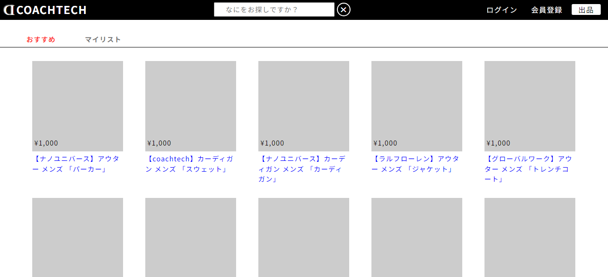
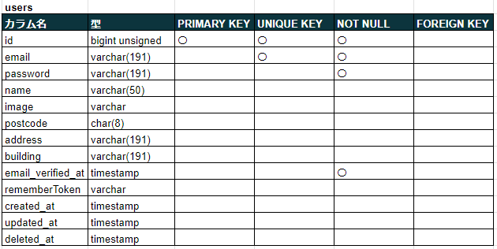
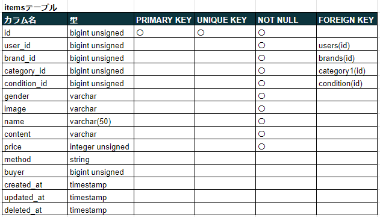
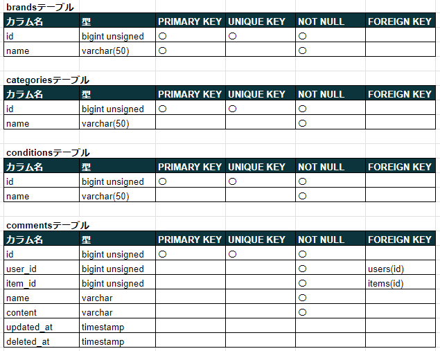
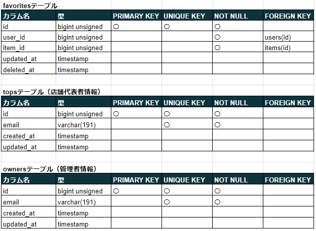
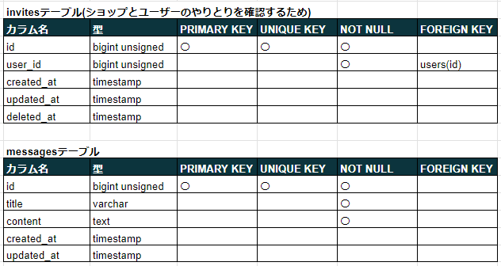
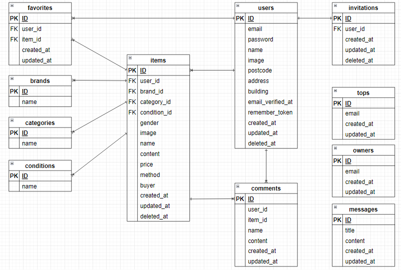
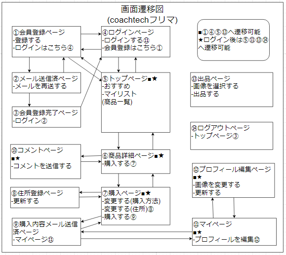

## アプリケーション情報

■ アプリケーション名<br />
・coachtechフリマサービス<br />

■ プロダクト概要<br />
・ある企業が開発した独自のフリマアプリ<br />
・ショップスタッフが出品した商品を、ユーザーが閲覧して購入するアプリ<br />
・管理者画面では、ショップスタッフの招待やメール送信を行う<br />

■ トップ画像<br />


## 作成した目的
・coachtechブランドのアイテムを出品する<br />

## アプリケーション URL
(1)本番環境<br />
https://xs668003.xsrv.jp/<br />
※xserverへデプロイ

(2)ローカル環境<br />
[アプリ]<br />
 localhost/<br />
[MailHog]<br />
 localhost:8025<br />

## 機能一覧
・会員登録<br />
・ログイン<br />
・ログアウト<br />
・商品一覧取得<br />
・商品詳細取得<br />
・ユーザ商品お気に入り一覧取得<br />
・ユーザ情報取得<br />
・ユーザ購入商品一覧取得<br />
・ユーザ出品商品一覧取得<br />
・プロフィール変更<br />
・商品お気に入り追加<br />
・商品お気に入り削除<br />
・商品コメント追加<br />
・商品コメント削除<br />
・出品<br />
・購入<br />
・配送先変更<br />
・ユーザー削除<br />
・ショップスタッフの招待<br />
・ショップスタッフの招待解除<br />
・招待履歴の取得<br />
・メール送信<br />

## 使用技術(実行環境)
■ 使用言語<br />
HTML<br />
CSS<br />
JavaScript<br />
PHP 8.2.10<br />

■ 使用フレームワーク<br />
Laravel Framework 10.26.2<br />

■ 使用認証方法<br />
未使用<br />

■ メール認証<br />
Mailpit<br />

## テーブル設計






## ER 図


## 画面遷移図


## 環境構築
■ 開発環境<br />
[土台]<br />
Docker<br />
LinuxOS<br />
[操作]<br />
ubuntu<br />
VSCode<br />
[サーバー]<br />
nginx<br />
[データベース]<br />
mysql<br />
[管理]<br />
Git<br />
GitHub<br />

■ 環境構築方法<br />
１、Laravel sailを使用して構築<br />
(1)Laravelプロジェクト作成<br />
```bash
curl -s https://laravel.build/Frema | bash
```
(2)Laravelプロジェクトへ移動<br />
```bash
cd Frema
```
(3)コンテナ起動<br />
```bash
sail up -d
```

２、GitCloneの場合<br />
(1)Git Clone<br />
```bash
git clone git@github.com:pcspread/Frema.git
```
(2)envファイル作成<br />
```bash
cp .env.example .env
```
(3)envファイル修正<br />
```bash
DB_HOST=mysql
DB_PORT=3306
DB_DATABASE=frema
DB_USERNAME=sail
DB_PASSWORD=password
```
(4)PHPパッケージインストール<br />
```bash
docker run --rm \
  -v $(pwd):/opt \
  -w /opt \
  laravelsail/php81-composer:latest \
  bash -c "composer install"
```
(5)Dockerコンテナ起動<br />
```bash
sail up -d
```
(6)アプリケーションキー作成<br />
```bash
sail artisan key:generate
```

## その他
■ ダミーデータ<br />
下記の内容で、seederファイルを登録しています。<br />
[内容]<br />
・ブランド名　　：６件<br />
・カテゴリー　　：６件<br />
・コンディション：５件<br />
・商品　　　　　：４０件<br />
・ユーザー　　　：７件<br />
(ダミーユーザー＋店舗代表者＋管理者)<br />
★下記で作成<br />
```bash
sail artisan migrate:fresh --seed
```

■ ログイン用ダミーデータ<br />
[一般ユーザー]<br />
・メールアドレス：test1@test.com～test5@test.com<br />
・パスワード　　：test1111(共通)<br />
[店舗代表者]<br />
・メールアドレス：top@top.com<br />
・パスワード　　：top12345<br />
[管理者]<br />
・メールアドレス：owner@owner.com<br />
・パスワード　　：owner12345<br />

■ メール認証<br />
新規登録時には、メール認証を行っています。<br />
ローカル環境の為、Mailpitを使用しています。<br />
[管理画面] http://localhost:8025

